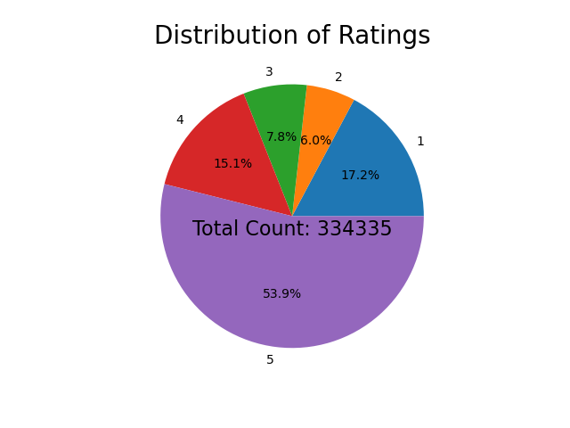
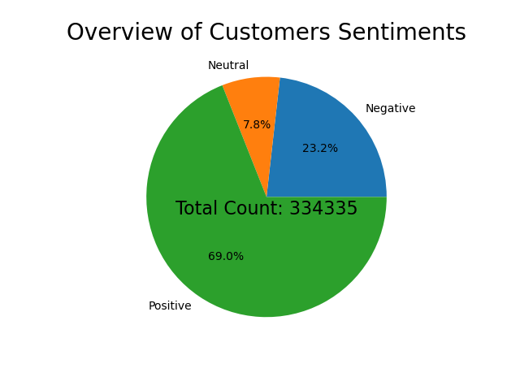

# Amazon Customers Sentiment Analysis

## Overview
Sentiment analysis is a natural language processing (NLP) technique that involves determining and extracting the sentiment or emotional tone expressed in a piece of text, such as a sentence, paragraph, or document. The goal of sentiment analysis is to understand and categorize the subjective information contained within the text as positive, negative, or neutral.

## Dataset 

We will use one of Amazon's Datasets which contains Product Name, Brand Name, Price, Rating, Reviews and Review Votes.

[Link](https://drive.google.com/file/d/1UJFPcMP8RtxUdniDIZTkr8kKFA-NWxz1/view?usp=sharing) to download the Dataset.

## Main aspects of sentiment analysis:

1. Text Input: Sentiment analysis typically works with text data from various sources, including social media posts, product reviews, news articles, customer feedback, and more.

2. Sentiment Categories: Sentiment analysis categorizes the sentiment expressed in the text into a predefined set of categories, often consisting of at least three classes: positive, negative, and neutral. Some sentiment analysis tasks may use more fine-grained categories or even sentiment scores.

3. Techniques: Sentiment analysis employs various techniques and algorithms, including machine learning, deep learning, and rule-based approaches. Machine learning models, like Support Vector Machines (SVM), Naive Bayes, and deep learning models like Recurrent Neural Networks (RNNs) and Convolutional Neural Networks (CNNs), are commonly used.

4. Feature Extraction: In sentiment analysis, features are extracted from the text to represent the content in a numerical or vectorized format. Common features include bag-of-words (BoW), term frequency-inverse document frequency (TF-IDF), word embeddings (e.g., Word2Vec, GloVe), and more.

5. Training and Classification: Supervised sentiment analysis models are trained on labeled datasets where text samples are associated with their corresponding sentiment labels. The model learns to predict sentiment labels for unseen text data based on the patterns it has learned during training.

6. Challenges: Sentiment analysis faces challenges such as handling sarcasm, irony, context, and cultural nuances. Additionally, dealing with subjective expressions, negations, and the context of the text can be complex.

## Applications of sentiment analysis

1. Brand and product reputation monitoring: Analyzing customer reviews and social media mentions to assess the sentiment towards a brand or product.

2. Customer feedback analysis: Understanding how customers feel about products or services by analyzing survey responses or comments.

3. Stock market prediction: Analyzing news articles and social media content to predict stock market trends based on sentiment.

4. Social media monitoring: Tracking public sentiment on social media platforms to assess public opinion on various topics.

5. Customer service improvement: Analyzing customer support interactions to gauge customer satisfaction and identify areas for improvement.

6. Political analysis: Assessing public sentiment towards political candidates, parties, and issues during elections or campaigns.

Sentiment analysis has become a valuable tool in a wide range of industries to better understand public perception, customer sentiment, and overall sentiment trends related to various subjects.

## CountVectorizer

CountVectorizer() will convert text into numeric features and will return the document-term matrix. 

In scikit-learn's CountVectorizer, features refer to the individual words or terms in a text corpus that the vectorizer uses to create a numerical representation of the text data. The CountVectorizer is a text preprocessing and feature extraction tool commonly used in natural language processing (NLP) tasks, such as text classification and clustering. It converts a collection of text documents into a matrix of token counts, where each row of the matrix corresponds to a document, and each column corresponds to a unique term or word in the entire corpus.

Here's how it works:

1. **Tokenization**: CountVectorizer first tokenizes the input text data, which means it breaks the text into individual words or terms. These terms are considered features.

2. **Feature Extraction**: For each term, it counts how many times that term appears in each document. These counts are then used to create the feature matrix. Each term becomes a feature, and the count of that term in a document is the value associated with that feature for that document.

By default, scikit-learn's CountVectorizer **does not perform stemming or lemmatization**. It treats words as individual tokens without any linguistic normalization. If you want to apply stemming or lemmatization to your text data, you would typically need to do this as a separate preprocessing step before using CountVectorizer.

Stemming and lemmatization are techniques used in natural language processing to reduce words to their base or root forms. Stemming reduces words to a common stem by removing suffixes, while lemmatization reduces words to their dictionary or lemma form.

## n-grams

In scikit-learn's CountVectorizer, the **ngram_range** parameter is used to specify the range of n-grams to be extracted from the text data. N-grams are contiguous sequences of n items (words or characters) in a text document. By setting the ngram_range, you can control the size of the n-grams that are considered when vectorizing the text.

The ngram_range parameter takes a tuple with two values: (min_n, max_n). These values define the minimum and maximum n-gram sizes to consider. For example, ngram_range=(1, 2) indicates that **both unigrams (single words) and bigrams (two-word sequences) should be considered** when creating the feature matrix.

## EDA and Feature Engineering

1. Load the dataset using Pandas.
2. Observe a few rows of the dataset carefully.
3. Check all feature columns present in it.
4. Use info() to check datatypes of all feature columns it also shows various info about the dataset.
5. Check for, if null values present in the dataset. 
6. Drop all missing values.
7. Plot the complete Distribution of Ratings on the pie chart.
8. Encode rating 4s and 5s as '1' i.e. Positive
9. Encode rating 1s and 2s as '0' i.e. Negative
10. Plot Positive, Neutral, and Negative sentiments count on the Pie Chart.
11. Drop rating = 3, as we consider it as a neutral rating.
12. Create a new feature column called 'Sentiment' where rating 4s and 5s are encoded as '1' i.e. Positive and rating 1s and 2s are encoded as '0' i.e. Negative.

## Distribution of Ratings Plot

## Overview of Sentiments Analysis Plot

## Model Fitting using Logistic Regression
1. We want to classify text reviews as Positive or Negative.
2. So, X should contain only the 'Review' feature column which has the user's sentiment information in text format.
3. y should contain only the 'Sentiment' feature column where Positive sentiments are encoded as 1 and Negative sentiments are encoded as 0.
4. Split the dataset into train and test sets.
5. Fit and transform the data into CountVectorizer().
6. CountVectorizer() will convert text into numeric features and will return the document-term matrix.
7. Now, we are ready for Binary Classification.
8. Fit the model using Logistic Regression.
9. Calculate the AUC score.
10. Check the model's performance by predicting any unknown text review.

## Using n-grams for more accuracy and then fitting the Model
1. In the last case, we are considering only single words and not word sequences.
2. Hence, the model is unable to identify the difference between 'issue' and 'not issue'.
3. This problem will be solved when we will use ngram_range in CountVectorizer().
4. Now, again fit and transform the data into CountVectorizer().
5. Fit the model using Logistic Regression.
6. Calculate the AUC score.
7. Check the model's performance by predicting any unknown text review.

### Now, let's jump into the Jupyter Notebook and take a look at the Python Code Implementation.
